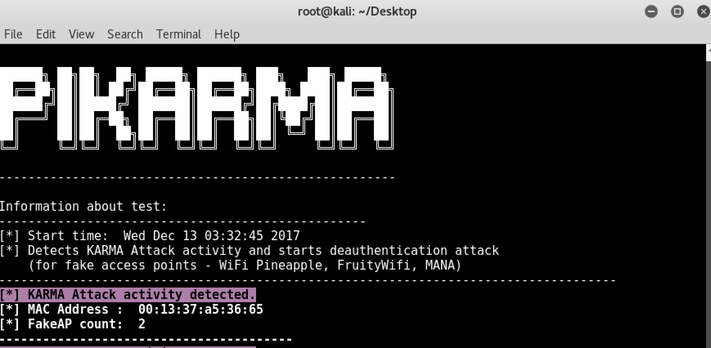

```python

                              ██████╗ ██╗██╗  ██╗ █████╗ ██████╗ ███╗   ███╗ █████╗ 
                              ██╔══██╗██║██║ ██╔╝██╔══██╗██╔══██╗████╗ ████║██╔══██╗
                              ██████╔╝██║█████╔╝ ███████║██████╔╝██╔████╔██║███████║
                              ██╔═══╝ ██║██╔═██╗ ██╔══██║██╔══██╗██║╚██╔╝██║██╔══██║
                              ██║     ██║██║  ██╗██║  ██║██║  ██║██║ ╚═╝ ██║██║  ██║
                              ╚═╝     ╚═╝╚═╝  ╚═╝╚═╝  ╚═╝╚═╝  ╚═╝╚═╝     ╚═╝╚═╝  ╚═╝

                            Detects wireless network attacks performed by KARMA module
```

<p align="center">
</a> 
<a href="https://www.blackhat.com/asia-18/arsenal/schedule/index.html#wipi-hunter---detects-illegal-wireless-network-activities-9854"></a>
<a href="https://defcon.org/html/defcon-26/dc-26-demolabs.html#WiPi-Hunter"></a>
</p>

#### Working Principle for PiKarma

+ Collects all the packets from Wireless Network. (Probe Response) 
+ Analyses all the packets in real time.
+ If PiKarma finds more than one SSID info from unique mac address in Probe Response;
+ Logs the activity with some extra information within defined template and sends deauthentication packets 


#### How works KARMA Attack?

+ Sends Probe Response for all Probe Requests

**Example:**


#### Softwares and hardwares that uses KARMA module

+ FruityWifi
+ WiFi Pineapple
+ Mana (improvements to KARMA attacks)
+ ..


#### Screenshots
</img>

#### Soon to be added features

+ New techniques for detect KARMA and MANA attacks
+ Logging SSID information used in KARMA and MANA attack

#### DEMO

+ https://www.youtube.com/playlist?list=PLwHi7Vsh6TpNrCX87KRzO9WVtHmqqC2aB

### Usage

#### Requirements

* **Hardware:** TP LINK TL-WN722N or Dark RangeMax wifi card
* **Modules:** scapy, time, termcolor, argparse, netifaces, logging

#### Kali Linux:

Download PiKarma:

`git clone https://github.com/WiPi-Hunter/PiKarma.git`

Install Python librarie(s):

`pip install termcolor`

It's done!

Run the program with following command: 

Monitor mode:

```python
airmon-ng start interface(wlan0,wlan1) (Monitor mode)

or 

ifconfig wlan0 down
iwconfig wlan0 mode Monitor
ifconfig wlan0 up
```

Run:

```python
cd PiKarma
python PiKarma.py -h
```


